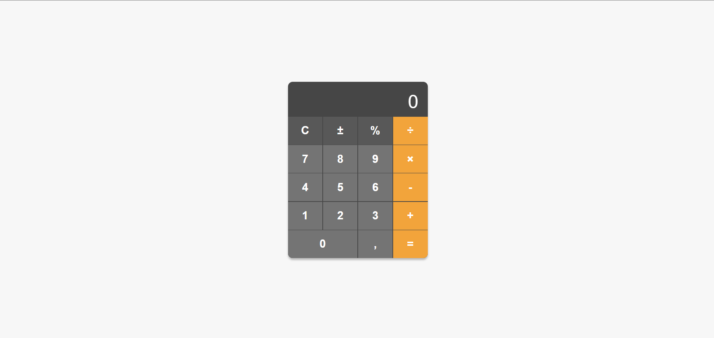

---

# Calculadora

Esta é uma calculadora simples desenvolvida usando **HTML**, **CSS**, e **JavaScript**. A calculadora permite realizar operações matemáticas básicas como adição, subtração, multiplicação, divisão e outras funcionalidades como o cálculo de porcentagem.

## Funcionalidades

- **Adição (+)**
- **Subtração (-)**
- **Multiplicação (×)**
- **Divisão (÷)**
- **Cálculo de porcentagem (%)**
- **Inversão de sinal (±)**
- **Limpar cálculo atual (C)**

## Estrutura do Projeto

```bash
/
├── css/
│   └── style.css         # Estilos da calculadora
├── js/
│   └── script.js         # Lógica da calculadora em JavaScript
└── index.html            # Interface principal da calculadora
```

### HTML (`index.html`)

O arquivo `index.html` define a estrutura da calculadora, incluindo os botões e a exibição do resultado.

### CSS (`style.css`)

O arquivo `style.css` estiliza a calculadora, criando um layout responsivo e visualmente agradável, com diferentes cores para botões de operação e numéricos.

### JavaScript (`script.js`)

O arquivo `script.js` contém toda a lógica da calculadora, incluindo:

- Manipulação de eventos dos botões.
- Cálculos matemáticos.
- Exibição e atualização do resultado.

## Como Usar

1. Clone este repositório:
   ```bash
   git clone https://github.com/GuiCavalcanteDev/calculadora.git
   ```

2. Abra o arquivo `index.html` em qualquer navegador moderno.

3. Use os botões da calculadora para realizar operações matemáticas básicas.

## Demonstração



## Tecnologias Utilizadas

- **HTML5** para a estrutura da página.
- **CSS3** para estilização e layout.
- **JavaScript** para implementação da lógica e interatividade.

## Melhorias Futuras

- Implementação de teclas do teclado para controlar a calculadora.
- Adicionar novas funcionalidades como cálculo de raízes quadradas e exponenciação.
